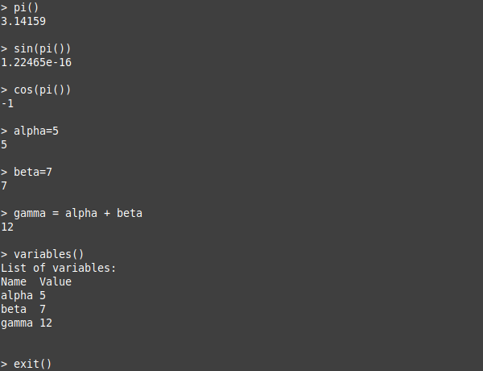

[](https://opensource.org/licenses/MIT)


# liir

## Overview

**liir** is a simple [REPL (Read, eval, print and loop)](https://en.wikipedia.org/wiki/Read%E2%80%93eval%E2%80%93print_loop) system developed in C. LIIR stands for `Leia, interprete, imprima e repita` which is the brazilian portuguese translation for the english acronym `Read, eval, print and loop - REPL`. 
Key features of this project include:

- Developed with C11;
- Cross-platform compatibility: It was tested on Linux and Windows, and can be compiled with GNU GCC, Clang, or MinGW;
- It is capable of saving and loading variables from a file;
- It can export the abstract syntax tree generated from expressions to a [graphviz](https://graphviz.org/) representation;
- All the operations are performed with double-precision floating-point numbers (64 bits);
- Run `./release/liir --help` to view available command-line options;

## Development Environment Setup

### Linux (using GCC or Clang)

To compile and run the project on Linux using GCC or Clang, follow these steps:

1. Ensure you have GCC or Clang installed on your system.
2. Open your terminal and navigate to the project directory.
3. Run the following commands:
   ```console
   $ make
   ```

## Cross-Compiling for Windows on Linux (using Mingw-w64)

You can cross-compile the liir project on a Linux system to generate a Windows executable. This allows you to create a Windows-compatible binary that can be tested using tools like Wine or transferred to a Windows machine.

Follow these steps to cross-compile the project:

1. Install Mingw-w64:
   Ensure you have Mingw-w64 installed on your Linux system. You can typically install it using your package manager. For example, on Ubuntu, you can run:
   ```console
   $ sudo apt-get install mingw-w64
   ```
2. Navigate to the Project Directory:
   Open a terminal and navigate to the directory where you have downloaded the liir project.
3. Cross-Compile the Project:
   Run the following commands to cross-compile the project using Mingw-w64. Replace x86_64-w64-mingw32-gcc with the appropriate cross-compiler command if needed (e.g., i686-w64-mingw32-gcc for 32-bit).
   ```console
   $ make CC=x86_64-w64-mingw32-gcc
   ```
   This command will generate a Windows executable in the ./release directory with a .exe extension.
4. Testing on Linux (Optional):
   You can test the generated Windows executable on your Linux system using Wine. If Wine is not installed, you can install it using your package manager.```console
   $ wine ./release/liir.exe
   ```
   This allows you to ensure that the Windows executable runs as expected on a Windows-like environment.
5. Transferring to Windows:
   To use the generated Windows executable on a Windows machine, simply transfer the liir.exe file to the Windows system, either via a network, USB drive, or any other method of your choice.
6. Running on Windows:
   On the Windows machine, you can execute the liir.exe file as you would with any other Windows program.

### Windows (using MSYS2 and Mingw64)

To compile and run the project on Windows, you'll need to set up the MSYS2 environment, install Make, and Mingw64. Follow these steps:

1. Install MSYS2:
   - Download the MSYS2 installer from the [official website](https://www.msys2.org/).
   - Run the installer and follow the installation instructions. Make sure to choose the appropriate architecture (e.g., 64-bit).
   - After installation, open the MSYS2 terminal from the Start menu.
2. Update MSYS2:
   In the MSYS2 terminal, run the following commands to update the package database and upgrade packages:
   ```console
   $ pacman -Syu
   ```
3. Install Make:
   Install the Make utility using the MSYS2 package manager:
   ```console
   $ pacman -S make
   ```
4. Install Mingw64:
   Install Mingw-w64 GCC for Windows development:
   ```console
   $ pacman -S mingw-w64-x86_64-gcc
   ```
5. Add Mingw-w64 to the PATH:
   To make it easier to use Mingw-w64 tools and compilers, you can add the Mingw-w64 binary directory to your system's PATH. Open the MSYS2 terminal and run the following command to edit the .bashrc file:
   ```console
   $ nano ~/.bashrc
   ```
   Add the following line to the end of the .bashrc file:
   ```console
   export PATH=$PATH:/mingw64/bin
   ```
   Save and exit the text editor (press Ctrl + X, then Y, and finally Enter).
   Close and reopen the MSYS2 terminal to apply the changes, or run the following command to reload the .bashrc without closing the terminal:
   ```console
   $ source ~/.bashrc
   ```
6. Navigate to the Project Directory:
   Open a new MSYS2 terminal and navigate to the directory where you have downloaded the liir project.
7. Compile and Run the Project:
   Run the following commands to compile the project using Make:
   ```console
   $ make
   ```

## Usage

To use liir, follow these simple steps:

1. Download this project and compile it using the instructions provided for your specific environment (Linux or Windows).
2. After successful compilation, run the executable:
   ```console
   $ ./release/liir
   ```
   To use it, just type the expression you want to evaluate and then press enter. Here is an example of usage:

   

## Troubleshooting

If you encounter any issues during the setup or usage of liir, please refer to the following troubleshooting tips:

- If you encounter compilation errors, make sure you have the required development tools and libraries installed on your system.
- Ensure that you are in the correct project directory when running the make command.
- If you encounter any bugs or unexpected behavior, please report them by creating an issue in the project's GitHub repository.
- Feel free to reach out to us if you need further assistance or have any questions.

Enjoy using **liir**!
